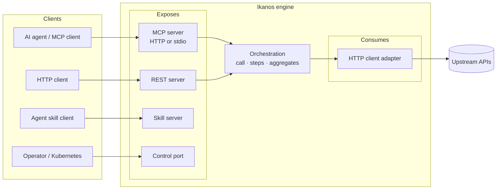
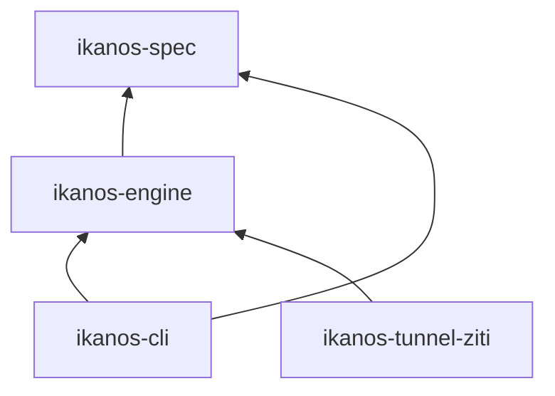
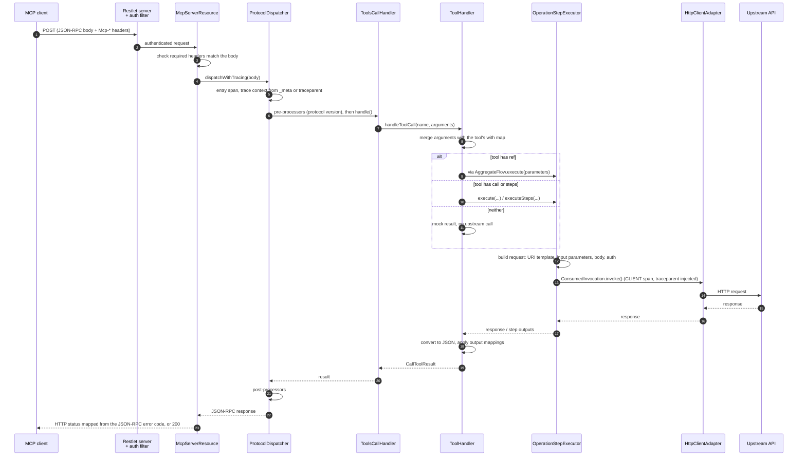

# Ikanos Architecture

This document explains how the Ikanos engine works inside: its modules, how a capability is loaded and started, and the path a request takes through the engine. It is written for contributors, people and coding agents, who need a mental model of the code before changing it.

It is not a user guide. What a capability author can declare, and what each feature does, is described in the [Ikanos specification on Shipyard](https://shipyard.naftiko.io/ikanos/spec/). This document covers how the engine implements it, where that code lives, and why it is built this way. For per-class detail, read the Javadoc and the `package-info.java` of each package.

> **Keep this file accurate.** Read the sections that cover the code you are about to change, and check them again after your change. If they are no longer true, update them in the same PR. The rule, and the changes that trigger it, are defined in [AGENTS.md](../../AGENTS.md#contribution-workflow).

## The big picture

A **capability** is a single YAML file. It declares which upstream APIs it **consumes**, how calls to them are combined (**orchestration**), and how the result is **exposed** to clients: as MCP tools, REST endpoints, or agent skills. Ikanos reads that file and runs it. There is no generated code and no Java written by the capability author.

The same three ideas appear everywhere in the code:

- **Spec model.** The YAML is deserialized into plain Java objects (`*Spec` classes in `ikanos-spec`). Nothing runs at this stage.
- **Adapters.** At startup, each `consumes` entry becomes a *client adapter* and each `exposes` entry becomes a *server adapter*. Adapters are the runtime objects that own sockets, routes and HTTP clients.
- **Execution.** When a request arrives, a server adapter resolves its parameters, hands them to the orchestration layer (`OperationStepExecutor`, or an `AggregateFlow`), which calls client adapters and maps their responses back into the shape the client expects.

## Code map

### Modules

| Module | What it owns |
|---|---|
| `modules/ikanos-spec` | The specification. The JSON Schema (`schemas/ikanos-schema.json`, the source of truth for the YAML format), the ruleset (`rules/ikanos-rules.yml`), the Jackson model the YAML is read into (`io.ikanos.spec`), and OpenAPI import/export (`io.ikanos.spec.openapi`). It has no runtime behaviour. |
| `modules/ikanos-engine` | The runtime. Loads a spec, builds the adapters, runs requests, and handles telemetry. Usable as a library (see [Extension points](#extension-points)). |
| `modules/ikanos-cli` | The `ikanos` command (Picocli, `io.ikanos.cli`): `serve`, `validate`, the import/export and scaffolding commands, and the clients of the control port. It builds the shaded `ikanos.jar` used by the Docker image and the GraalVM native binary. |
| `modules/ikanos-tunnel-ziti` | An optional OpenZiti implementation of the reverse-tunnel SPI. It is discovered with `ServiceLoader` when the jar is on the classpath. |
| `modules/ikanos-docs` | No code. This document, the tutorial capabilities (`tutorial/`), demos, and test documentation. |
| `modules/ikanos-coverage` | No code. Aggregates JaCoCo coverage across modules for the quality gate. |

The JSON Schema and the ruleset are also synchronized to Crafter, the Naftiko VS Code extension, by the `synchronize-schema-and-rules` workflow. A change to either one reaches editors too.

### Engine packages

All engine code lives under `io.ikanos`, in `modules/ikanos-engine/src/main/java`:

| Package | Role |
|---|---|
| `io.ikanos` | `Capability`: the root runtime object. Builds and holds every adapter, the aggregates and the resolved bindings. |
| `io.ikanos.bootstrap` | `CapabilityRuntime`: what `ikanos serve` runs. Reads the file, starts telemetry, starts the capability, waits for shutdown. |
| `io.ikanos.engine` | `Adapter`: the start/stop contract shared by all adapters. |
| `io.ikanos.engine.consumes` | `ClientAdapter` base class, the protocol-neutral call carriers (`ConsumedInvocation`, `ConsumedResult`, `Outcome`) and the `ClientAdapterRegistry` that creates adapters by `type`. |
| `io.ikanos.engine.consumes.http` | `HttpClientAdapter`: calls an upstream HTTP API, with its authentication. |
| `io.ikanos.engine.consumes.tunnel` | The reverse-tunnel SPI (`Tunnel`) and its bootstrap. |
| `io.ikanos.engine.util` | The orchestration core: `OperationStepExecutor` (runs calls and steps), `Resolver` (Mustache templates, parameter extraction, output mapping), `Converter` (non-JSON formats to JSON), `LookupExecutor`, `BindingResolver`. |
| `io.ikanos.engine.aggregates` | Reusable domain flows (`Aggregate`, `AggregateFlow`) and the load-time `ref` resolution (`AggregateRefResolver`). |
| `io.ikanos.engine.scripting` | `ScriptStepExecutor`: sandboxed script steps. |
| `io.ikanos.engine.step` | The embedding API: Java `StepHandler`s registered by step name. |
| `io.ikanos.engine.imports` | Resolves `import` entries in `consumes`, `exposes`, `aggregates` and `binds` before anything else runs. |
| `io.ikanos.engine.exposes` | `ServerAdapter` base class and the shared authentication filters. |
| `io.ikanos.engine.exposes.mcp` | The MCP server: transports, `ProtocolDispatcher`, per-method handlers, tool/resource/prompt handlers. |
| `io.ikanos.engine.exposes.rest` | The REST server: routing and `ResourceRestlet`. |
| `io.ikanos.engine.exposes.skill` | The Skill server: a read-only catalog of agent skills. |
| `io.ikanos.engine.exposes.control` | The control port: health, status, metrics, traces, scripting management. |
| `io.ikanos.engine.observability` | OpenTelemetry bootstrap, metrics, trace context propagation. |

The HTTP layer on both sides is Restlet. Server adapters are Restlet `Server`s with a chain of `Restlet`s; client adapters wrap a Restlet `Client`.

## Spec and validation

The YAML format is defined once, in `modules/ikanos-spec/src/main/resources/schemas/ikanos-schema.json`. Everything else follows it:

| Layer | Where | Role |
|---|---|---|
| JSON Schema | `schemas/ikanos-schema.json` | The source of truth for structure: which keys exist, their types, which are required. `schemas/README.md` documents it, and `schemas/examples/` holds reference capabilities. |
| Ruleset | `rules/ikanos-rules.yml` | Checks the schema cannot express: cross-object consistency (a `call` points to a declared operation), quality and security rules. It is written in the Spectral format and is the ruleset Polychro applies. |
| Jackson model | `io.ikanos.spec` | The `*Spec` classes the YAML is read into. Polymorphic sections are picked by custom deserializers: `ServerSpecDeserializer` by `type`, `ClientSpecDeserializer` by the presence of `from` (an import), and similar ones for parameters, steps and bindings. |

Validation runs **outside** the runtime:

- `ikanos validate` checks a file against the JSON Schema. It builds its validator with `IkanosMetaSchemaFactory`, which teaches the schema library the Ikanos `name` keyword.
- In CI, the MegaLinter workflow (`.mega-linter.yml`, `.spectral.yaml`) runs the ruleset with Spectral on the tutorial, the examples and the test fixtures. Moving that check to Polychro is tracked in [#382](https://github.com/naftiko/ikanos/issues/382).

The spec version (`ikanos: "1.0.0-..."`) comes from the Maven build: `VersionHelper` reads it from the filtered `version.properties`, and `scripts/sync-schema-version.py` updates the version strings in fixtures and examples at each bump.

## Life of a capability: startup and shutdown

`ikanos serve [file]` calls `CapabilityRuntime.serve`. From there, the order matters, and the comments in `Capability`'s constructor explain why:

1. **Read the YAML** into an `IkanosSpec` with Jackson. Unknown properties are ignored, and the file is **not** validated against the JSON Schema here (see [Invariants](#invariants-and-design-decisions)).
2. **Start telemetry** (`TelemetryBootstrap.init`), configured from the control adapter's `observability` block if there is one.
3. **Build the `Capability`**:
    1. **Resolve imports** in a fixed order: `consumes`, then `aggregates`, then `exposes`, then `binds` (`ImportResolver`, with one `ImportStrategy` per section). After this pass every section contains only inline entries.
    2. **Resolve aggregate refs** (`AggregateRefResolver`). Every `ref` must point to a known flow, otherwise startup fails. MCP tool hints are derived from the flow's `semantics`.
    3. **Find the scripting settings** on the control adapter, if any.
    4. **Build the aggregates** (`Aggregate` / `AggregateFlow`), sharing one `OperationStepExecutor`.
    5. **Resolve bindings** (`BindingResolver`): from a file when the binding has a `location`, otherwise from the runtime environment.
    6. **Construct the server adapters**, one per `exposes` entry, chosen by its `type`. A capability must expose at least one.
    7. **Discover and start tunnels** declared by `consumes` entries (`TunnelBootstrap.discoverAndStart`), and wait for them to be ready, with a timeout set by the caller.
    8. **Construct the client adapters**, one per `consumes` entry, handing each its tunnel if it has one.
4. **Start**: client adapters first, then server adapters, so nothing accepts a request before it can call upstream.
5. **Wait** until the JVM shuts down. A shutdown hook stops the capability once: server adapters first, then client adapters.

Two consequences for contributors:

- An adapter **constructor must not** call `getClientAdapters()` or `getServerAdapters()`: they are not published until the end of the `Capability` constructor. Do cross-adapter lookups at request time or in `start()`.
- Anything that can be checked at load time (an unknown `ref`, a malformed skill tool) should fail **here**, not on the first request.

## Life of a request

### An MCP `tools/call` over HTTP

This is the most complete path through the engine:

What this path shows about the MCP adapter:

- **Transport and protocol are separate.** In the MCP adapter, `McpServerResource` holds everything specific to HTTP (header checks, HTTP status codes, content types), and `ProtocolDispatcher` holds the MCP protocol, shared with the stdio transport (`StdioJsonRpcHandler`). A protocol change belongs in the dispatcher or a handler, never in a transport.
- **One handler per JSON-RPC method.** Each method has its own `McpCallHandler` subclass in `exposes.mcp.handler`, built once per adapter by `McpCallHandlersFactory`, which is the list of supported methods. Each handler declares the MCP headers it requires, its pre-processors and its post-processors (`exposes.mcp.processor`).
- **Protocol versions.** The supported versions are defined in one place, `ProtocolDispatcher.SUPPORTED_PROTOCOL_VERSIONS` (at the time of writing, 2026-07-28 only). A request with an unsupported version, including a legacy `initialize` (`LegacyInitializeHandler`), gets an explicit `UnsupportedProtocolVersionError` that names the supported versions.

### Errors

Every adapter keeps internal detail out of its responses: an unexpected failure returns a generic message with a reference id, and the detail is logged under that id (`ErrorReference`). How the failure is reported depends on the adapter:

- **MCP**: a bad argument (`IllegalArgumentException`) becomes a JSON-RPC `invalid params` error. Any other failure while running a tool becomes a tool result with `isError: true` (`ToolsCallHandler`).
- **REST**: a bad input becomes `400`, a failed upstream step (`StepFailedException`) `502`, any other failure `500`, with a plain-text body (`ResourceRestlet.sendError`).

### Other entry points

- **MCP over stdio**: `StdioJsonRpcHandler` reads JSON-RPC lines from stdin and writes responses to stdout, through the same `ProtocolDispatcher`. Stdout is reserved for the protocol, so all logs go to stderr.
- **REST**: `RestServerAdapter` attaches one `ResourceRestlet` per resource path. `ResourceRestlet` first looks for an operation matching the HTTP method and runs it (see [Execution modes](#execution-modes)). Only when no operation handles the request does it fall back to `forward`, which proxies the request to a consumed API; otherwise it answers `404`.
- **Skill**: read-only. It serves skill metadata and files and never runs a call itself; a skill tool that runs something points to a tool of a sibling MCP or REST adapter.
- **Control port**: engine-defined management endpoints, no orchestration.

## Consumes: calling upstream APIs

Each `consumes` entry becomes a `ClientAdapter`, created by `ClientAdapterRegistry` from the entry's `type` (HTTP when absent). Adapter types are discovered with `ServiceLoader` (`ClientAdapterFactory`), and their spec types with `ClientSpecTypes` in `ikanos-spec`. An HTTP entry becomes an `HttpClientAdapter`, which owns one Restlet `Client` for HTTP and HTTPS.

For a `call` or a call step, `OperationStepExecutor.findClientRequestFor` finds the client adapter by namespace and asks it to `prepare` the operation, which returns a `ConsumedInvocation`. For HTTP, `HttpClientAdapter.prepare`:

1. Find the operation by name.
2. Resolve `baseUri` + resource `path` as a Mustache template. Fail if any `{{...}}` is left.
3. Apply the input parameters, adapter level first, then operation level.
4. Build the body when the operation declares one. Fail if any template is left unresolved. Form bodies go through `FormUrlEncodedBody`, which URL-encodes every substituted value so that a caller cannot add form fields.
5. Set authentication and default headers through the client adapter (`HttpClientAdapter.setChallengeResponse` and `setHeaders`). Authentication values are resolved against the request parameters **and** the capability's bindings.
6. Return an `HttpInvocation`: the prepared request, with the adapter and operation that produced it.

`ConsumedInvocation.invoke()` is a template method: it opens the CLIENT span, runs the protocol-specific `doInvoke()` inside it, annotates the span from the result, records the client metrics and closes the span, so a new adapter cannot forget to trace. `HttpInvocation` injects W3C trace context so the upstream sees Ikanos as the parent. The call returns a `ConsumedResult` (status, `Outcome`, body), which orchestration and the exposers read without knowing the protocol. A call step only feeds later steps when `ConsumedResult.isSuccessful()` (strictly 2xx).

**The REST `forward` path is the exception.** `ResourceRestlet.handleFromForwardSpec` builds and sends its own request: it reuses the adapter's authentication and headers, but it does not go through `ConsumedInvocation`, so a forwarded call has no CLIENT span, no injected trace context and no client metrics. This is a known gap, in scope for the audit of divergent implementations ([#667](https://github.com/naftiko/ikanos/issues/667)).

**Reverse tunnels.** A `consumes` entry can declare a `tunnel` to reach a private API through an overlay network. `Tunnel` is a `ServiceLoader` SPI (`io.ikanos.engine.consumes.tunnel`). `TunnelBootstrap` discovers the implementations at startup, and requests to the adapter's host are routed through the tunnel by a Jetty request listener (`TunnelAwareHttpClientHelper`). `ikanos-tunnel-ziti` is an implementation of this SPI.

## Orchestration: from parameters to a result

### Execution modes

Every executable unit (an MCP tool, a REST operation, an aggregate flow) runs in one mode, chosen from what it declares: a `ref` to an aggregate flow, a single `call`, a sequence of `steps`, or none of these (a mock built from the output parameters). The [specification](https://shipyard.naftiko.io/ikanos/spec/exposes/) describes what each mode does.

In the code, the same decision is made in three places: `ToolHandler`, `ResourceRestlet` and `AggregateFlow`. A change to the modes therefore touches all three.

**Aggregates** follow the DDD aggregate pattern: a flow is defined once and projected through several adapters. At load time, `AggregateRefResolver` copies only descriptive metadata (name, description, MCP hints derived from `semantics`) onto the adapter unit. The execution fields are **not** copied: at request time the adapter delegates to the `AggregateFlow`, so there is one copy of the logic.

### Steps

`OperationStepExecutor.executeSteps` runs the steps in declaration order. Before the normal dispatch, it checks whether a Java `StepHandler` is registered under the step's name (embedding API); if so, the handler runs instead. Otherwise it dispatches on the step's spec class: a call step goes through `findClientRequestFor` like a single call, a lookup step through `LookupExecutor`, a script step through `ScriptStepExecutor`. The step types and their fields are in the [specification](https://shipyard.naftiko.io/ikanos/spec/steps/).

Each step gets its own span and step metric. Its output is added to the parameters under the step's name, which is how later steps and templates read it.

A call step whose upstream response is not 2xx, or that gets no response, stops the sequence: `failIfUnsuccessful` throws a `StepFailedException` naming the step, and the remaining steps do not run. Each adapter turns that exception into its own error (see [Errors](#errors)).

### Parameters and templates

A request's parameters start as the client's arguments (or the REST inputs), merged with the unit's `with` map, and grow with each step output. Templates are rendered by `Resolver.resolveMustacheTemplate` (JMustache), and output mappings are JSONPath expressions (Jayway) applied by `Resolver`.

### Data formats

Inside the engine, **all structured data is JSON**: Jackson `JsonNode` for trees, `Map`/`List` for template rendering. `Converter.convertToJson` turns an upstream response in another format into JSON at the boundary, based on the format the operation declares; the supported formats are the values of `ConversionFormat`. Mappings and lookups therefore only ever deal with JSON.

**Binary** content is the exception: it is read with a size cap and passed through without decoding.

### Scripting

`ScriptStepExecutor` runs script steps in a sandbox: JavaScript and Python in a GraalVM polyglot context, Groovy in a `GroovyShell` restricted by a `SecureASTCustomizer` and `GroovySandboxExpressionChecker`. Every script runs with a timeout. Whether scripting is allowed, and for which languages, is decided in `ScriptStepExecutor` from the environment and the control adapter's settings, the control adapter taking precedence.

## Exposes: the server adapters

All server adapters extend `ServerAdapter`, which owns the Restlet `Server` lifecycle and builds the **authentication chain** in front of the adapter's router (`buildServerChain`). The filter is chosen by the authentication type: a Restlet `ChallengeAuthenticator` (with constant-time comparison), `ServerAuthenticationRestlet` or `OAuth2AuthenticationRestlet`. The MCP adapter uses `McpOAuth2Restlet`, which also serves the OAuth Protected Resource Metadata that MCP clients look for.

Authentication runs **before** any protocol handling: an unauthenticated request never reaches the MCP dispatcher or a REST operation.

| Adapter | Where its routes are defined | Notes |
|---|---|---|
| `McpServerAdapter` | One endpoint over HTTP (`McpServerResource`), or stdio | Builds the advertised MCP tools at startup: the input schema from the input parameters (or from the flow for a `ref`), annotations from hints, and an output schema when the tool has an output contract. |
| `RestServerAdapter` | One route per resource path declared in the spec | |
| `SkillServerAdapter` | Attached in `SkillServerAdapter` | Validates the skill tools at startup. |
| `ControlServerAdapter` | Attached in `ControlServerAdapter` | Each route is only attached when the matching management or observability option is on. The `ikanos` control-port commands are its clients. |

## Observability

`TelemetryBootstrap` holds the engine's single OpenTelemetry instance. It is configured by the OTel environment variables, overridden by the control adapter's `observability` block, and falls back to a **no-op** implementation when telemetry is disabled or the OTel SDK is not on the classpath. Engine code therefore always calls the telemetry API, with no `if enabled` checks.

What gets a span:

- **Entry** spans: each incoming request, from `ProtocolDispatcher.dispatchWithTracing` (MCP), `ResourceRestlet` (REST) and `SkillServerResource` (Skill). The span is SERVER when Ikanos is the entry point, and INTERNAL when the caller already sent trace context, because the caller's span is then the real SERVER span (`TelemetryBootstrap.startServerSpan`).
- **INTERNAL** spans: a tool call, an aggregate flow, each step.
- **CLIENT** spans: each upstream call, in `ConsumedInvocation.invoke()` (except REST `forward`, see [Consumes](#consumes-calling-upstream-apis)).

Incoming trace context is read per adapter:

- **MCP** reads it from the request's `params._meta` (`McpMetaTraceContextBridge`). Over HTTP it falls back to the `traceparent` header; over stdio `_meta` is the only carrier.
- **REST** and **Skill** read the `traceparent` header (`OtelRestletBridge`).

Outgoing, trace context is injected into upstream requests. The trace id is also put in the logging MDC and used as the `ErrorReference`, so a reference returned to a client finds both the log line and the trace (`/traces/{traceId}` on the control port).

Metrics (`EngineMetrics`) are exposed in Prometheus format by the control port.

## Extension points

| To add... | Start from |
|---|---|
| A new kind of **exposed** adapter | Subclass `ServerAdapter`, add a `*ServerSpec` and its `type` case in `ServerSpecDeserializer` (`ikanos-spec`), and instantiate it in the `Capability` constructor. |
| A new kind of **consumed** adapter | Subclass `ClientAdapter` and implement `prepare` to return a `ConsumedInvocation` subclass that produces a `ConsumedResult`. Register a `ClientAdapterFactory` and a `ClientSpecType` (for the `*ClientSpec`) in `META-INF/services`. `Capability`, `OperationStepExecutor` and the exposers need no change. |
| A new **MCP method** | A `McpCallHandler` subclass, registered in `McpCallHandlersFactory` with its required headers and processors. |
| A new **step type** | An `OperationStep*Spec` in `ikanos-spec` (like `OperationStepCallSpec`) and a case in `OperationStepExecutor.executeSteps`. |
| A new **data format** | A `ConversionFormat` value and a converter in `Converter`. |
| A new **tunnel transport** | Implement `Tunnel` in its own module and register it in `META-INF/services/io.ikanos.engine.consumes.tunnel.Tunnel`, like `ikanos-tunnel-ziti`. |
| Custom Java logic, when **embedding** the engine | `Capability.builder()` with a `StepHandler` registered by step name. The handler replaces the step of that name. |

Any change to the YAML format starts in `ikanos-schema.json`. The Jackson model, the ruleset, the examples and the tutorials follow, and the schema is the reference when they disagree.

## Tests

| Level | Where | Runs |
|---|---|---|
| Unit | `src/test/java` of each module, next to the class under test (`ResolverTest`, `ConverterTest`, ...) | `mvn test`, on every PR |
| Integration | Classes named `*IntegrationTest`, mostly in `ikanos-engine`. They load a capability YAML (fixtures in `src/test/resources`, or inline with the version from `VersionHelper`), build a `Capability`, and call it through an adapter, often against a local Restlet stub of the upstream. | `mvn test`, on every PR |
| Tutorial | The tutorial capabilities, from the engine's copy in `src/test/resources/tutorial`: the `io.ikanos.tutorial` tests call them as an MCP or REST client, and `validate-tuto-examples` serves each one with the CLI jar against Microcks mocks | `mvn test` on every PR; the workflow on PRs that change main code or a `pom.xml` |
| End to end | `.github/e2e/resources/features/<feature>/`: a `capability.yml` and a `run.sh` each, run against the Docker image with Microcks and Keycloak | `e2e-feature-tests`, nightly and on demand |

Coverage is measured by JaCoCo and aggregated across modules by `ikanos-coverage`. `mvn verify`, which the `quality-gate` workflow runs, fails below the thresholds set by the `jacoco.line.min` and `jacoco.branch.min` properties in the root `pom.xml`. The test-writing rules (naming, unit vs integration, the bug workflow) are in [AGENTS.md](../../AGENTS.md).

## Invariants and design decisions

These hold across the codebase. Breaking one needs a deliberate decision, not a side effect.

- **The capability is the whole program.** Everything a capability does is declared in its YAML. The engine adds no behaviour the YAML cannot see, apart from the engine-defined control port.
- **The runtime does not validate the schema.** `serve` reads the YAML leniently and ignores unknown properties. Validation is a separate step (see [Spec and validation](#spec-and-validation)). Errors the runtime cannot work around, such as an unknown `ref` or a missing exposed adapter, still fail at load time.
- **Load-time over request-time.** Imports, refs and adapter configuration are resolved and checked once at startup. Request handling assumes a consistent spec.
- **Clients start before servers, and servers stop before clients.**
- **JSON inside, other formats at the edge.** Conversion happens when data enters (`Converter`) and the protocol shape is built when it leaves. Binary is passed through, never decoded.
- **Secrets stay in authentication.** The resolved `binds` are only used for authentication, on both sides: the credentials a server adapter checks (`ServerAdapter`, `ServerAuthenticationRestlet`) and the credentials a client adapter sends (`HttpClientAdapter`), plus the tunnel identity. They are not merged into the parameters used for URLs, bodies and steps.
- **No internal detail in error responses.** Unexpected failures return a generic message and a reference id. The detail goes to the server log under that id (`ErrorReference`).
- **MCP protocol logic is transport-agnostic.** In the MCP adapter, protocol logic lives in `ProtocolDispatcher` and the handlers, shared by HTTP and stdio. Transports only translate I/O.
- **Supported protocol versions have a single source of truth.** A client using an unsupported version gets an explicit error, never a silent downgrade.
- **Telemetry is always on in code, optional at runtime.** Code always creates spans and metrics; a no-op instance makes them free when telemetry is off.
- **Factor by default.** Mechanisms that recur across adapters (Mustache resolution, JSONPath extraction, authentication, header handling) have one shared implementation. Fix a defect in every place that shares the mechanism, not only where it was reported (see [AGENTS.md](../../AGENTS.md)). The audit in [#667](https://github.com/naftiko/ikanos/issues/667) looks for the places that still diverge.
- **Thread safety for a future hot reload.** `Capability` and the adapters hold their mutable state in `AtomicReference`s and copy-on-write lists, so a new spec could be swapped in while requests are running.

## Where to start reading

| To understand... | Read |
|---|---|
| Startup | `CapabilityRuntime.serve`, then the `Capability` constructor |
| An MCP request | `McpServerResource.handlePost`, `ProtocolDispatcher.dispatch`, `ToolHandler.doHandleToolCall` |
| A REST request | `ResourceRestlet.handle` |
| How a call is built and sent | `OperationStepExecutor.findClientRequestFor`, `HttpClientAdapter.prepare` and `ConsumedInvocation.invoke` |
| Steps | `OperationStepExecutor.executeSteps` |
| Templates and mappings | `Resolver` |
| The YAML format | `modules/ikanos-spec/src/main/resources/schemas/ikanos-schema.json` and the examples next to it |
| Contribution rules and conventions | [CONTRIBUTING.md](../../CONTRIBUTING.md) and [AGENTS.md](../../AGENTS.md) |
